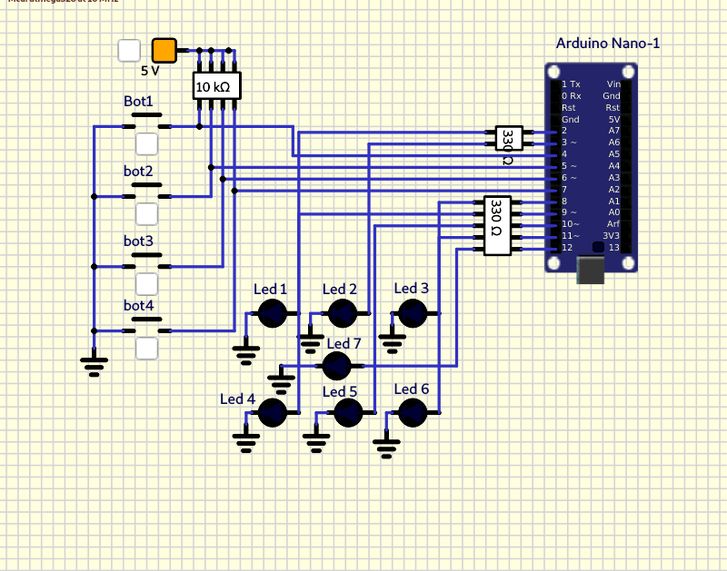

# TP2

## Dado electrónico. 

Utilizando un Arduino Nano (`atmega328p`), `6 ó 7 LEDs` y `3 Pulsadores` se pide:

1. Al presionar el `pulsador 1` se **encienden** los `LEDs` **barajando** las posibles respuestas
rápidamente.

2.  Al presionar el `pulsador 2` se **detiene** el cambio de los `LEDs`, **quedando encendidos**
aquellos que indican la "cara del dado que quedo hacia arriba". 

3. Una vez que se indica el `resultado`, se debe poder presionar el `pulsador 3 o 4` para
**apagar** los `LEDs` de manera de volver a la condición inicial.

> Nota: Todos los pulsadores `deben` tener habilitada la resistencia de `pull-up`

> Asi mismo los LEDs deben conectarse con su resistencia limitadora de corriente 2 asegurando no superar la corriente máxima que puede entregar el pin. Almenos de 330 Ohms.

## ¡USAR LOS PINES INDICADOS NO CAMBIARLOS!

``` C
PD4 -> BOTON 1 
PD5 -> BOTON 2 
PD6 -> BOTON 3 
PD7 -> BOTON 4

PD2 -> LED 1   
PD3 -> LED 2 
PB0 -> LED 3
PB1 -> LED 4 
PB2 -> LED 5 
PB3 -> LED 6
PB4 -> LED 7

```
## Pinout


## Circuito


